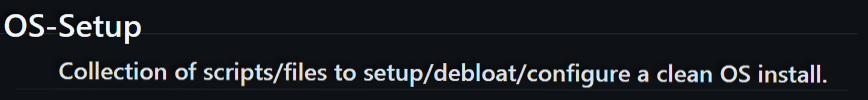

## Windows 11 Instructions
### Uncomment desired functionality in: .\main.ps1.
- All possible behaviors/values of Enums, are defined right above/alongside Function Definitions that use the Enum in question. Use like so: `TaskBarAlignment ([Alignment]::Left)`
- Change List of bloat/software to uninstall/install at top of file: `.\modules\Winget.psm1`
### PowershellConfigurer
- PowershellConfigurer standard behavior uses hard-coded values set to [Microsoft Standard Spec](https://learn.microsoft.com/en-us/powershell/module/microsoft.powershell.core/about/about_profiles?view=powershell-5.1).  
	- However, in current versions of Win10/11 Home, OneDrive sets the Powershell global automatic variable: $profile to [Specifically what Microsoft Recommends Against](https://learn.microsoft.com/en-us/powershell/module/microsoft.powershell.core/about/about_profiles?view=powershell-7.4).  
	- If you uncommented: `UninstallAndAttemptAnnihilationOfOneDrive` in main.ps1, your $profile paths have already been fixed and set back to recommended specs. For a different work-around, read on...
- To quickly check your status, run `$profile` in powershell console. The older, correct, classic path for WindowsPowershell(5.1) is: `C:\Users\{username}\Documents\WindowsPowershell\{profileFile}.ps1`,  
while the discouraged path will look like: `C:\Users\{username}\OneDrive\Documents\...`
- Nevertheless, if you'd like to continue with the latter setup, make sure to chain in `SetCurUserDir()` before proceeding as you normally would. Example use: `[PowershellConfigurer]::new().SetCurUserDir().SaveProfileFilesToScriptPackage()`
- Besides using `Install()` for CurrentUser, you can also chain in `Install_ForAllUsers`. [PowershellConfigurer]::new()
- VsCode
	- VsCode Configuration has been automated. Inversely, 'VsCode::new().BackupVsCode()', will pull your VsCode settings from the computer and save them to this ScriptPackage. 
- Run Powershell as Admin. CD into Windows11 folder and run: './main.ps1'. Note: Powershell 5.1+ required, the standard default pre-installed version on modern Windows machines.
- Restart computer.